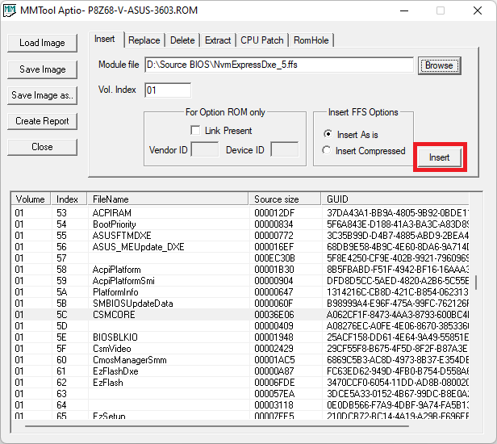

# Como adicionar suporte Nvme M.2 a placas antigas.

Placas mães sem suporte para módulos NVMe em suas BIOS não permitem o boot através desses dispositivos. Mesmo ao empregar adaptadores PCI Express para incorporar unidades NVMe, a capacidade de inicialização por eles permanece limitada, com exceção de situações específicas, como ocorre com os NVMe da Samsung.

Inserir o módulo na BIOS é teoricamente simples, mas devido à natureza das atualizações de BIOS, isso pode envolver certos riscos.

A minha placa mãe em questão é a [GA-H61M-S1 rev 4.0](https://www.gigabyte.com/br/Motherboard/GA-H61M-S1-rev-40), o adaptador usado é o **AD135 da Knup** com o **NVMe M.2 de 500GB da Kingston**.

## Itens necessários
1. [Um editor de BIOS](editor/editor_mmtool.zip)
2. [Módulo NVMe Express DXE](modules/NvmExpressDxe_5.ffs)
3. Firmware da BIOS (Baixe de acordo com sua placa mãe)

## Procedimento
1. Abra o editor, e carregue o firmware clicando no botão "Load Image"
    

2. Encontre o módulo **CMSCORE** na lista. O CMSCORE indica em qual volume se encontra o DXE.
    

3. Selecione o volume correto e procure o [módulo NVMe Express DXE](modules/NvmExpressDxe_5.ffs)
    

4. Insira o módulo ao firmware
    

Salve o firmware em "Save Image as..." e siga o processo padrão de atualização da BIOS. Após a atualização, a opção de boot para NVMe estará disponível na BIOS.

Fonte: [Howto Get full NVMe support for all system with an AMI UEFI BIOS](https://winraid.level1techs.com/t/howto-get-full-nvme-support-for-all-systems-with-an-ami-uefi-bios/30901)